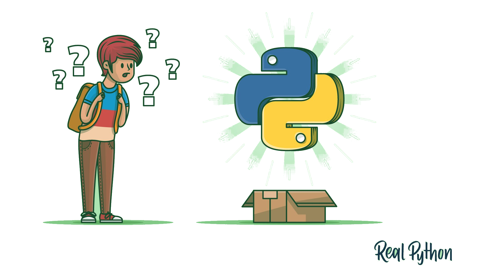

# Python projects

This repository is designed to collect several projects in order to acquire some expertise about python language.
The following projects are stored:
<ul>
  <li> CPU_Threading: manage CPU's threads. </li>
  <li> Email-API: send email through python. </li>
  <li> FraudeDetection: SMOTE algorithm. </li>
  <li> Introduction: basic knowledge about python tools and classes. </li>
  <li> Multi-clipboard: multi-clipboard tool. </li>
  <li> <b> PaperRockScissor</b>: it's the implementation of the traditional game. This project is useful to make some practice with the <b> try-except </b> commands. </li>
  <li> pre-commit: try pre-commit config on awful python function. </li>
  <li> <b> QRCode</b>: I used the qrcode library to create some QR code and figure out what this. </li>
  <li> <b> Stumpy library</b>: it' s a library for computing the matrix profile. It supports also some approximations to speed up the computation. </li>
  <li> Weather-API: openWeather API to get weather information. </li>
  <li> Browser: create a browser and embed a webpage. </li>
  <li> Whatsapp: send a programmed message through whatsapp. </li>
</ul>

    

